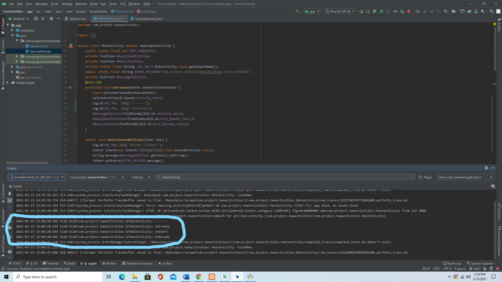

Activity lifecycle and state
============================
### TASK 1
#### Displaying log messages to see how MainActivity changes its lifecycle states from the state of activity being created till the activity being destroyed.
 

#### Analyzing the lifecycle states of two activites MainActivity and SecondActivity through log messages.
 
