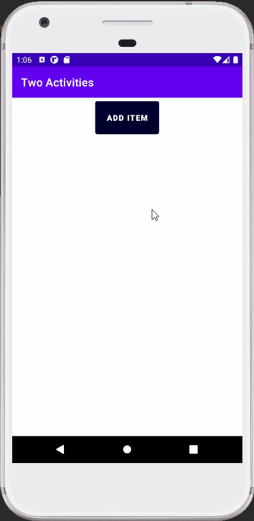

Activity Lifecycle and State
============================
### Coding Challenge

This is a shopping-list app which contains two activities MainActivity and SecondActivity. MainActivity shows
the list of items added by the user and there is also a add button which sends the user to the secondactivity. SecondActivity 
contains the list of items available. By clicking on those items user can add the item.

##### App demonstration

#### Checking if the current state of the shopping list is saved, when the user rotates the phone.
